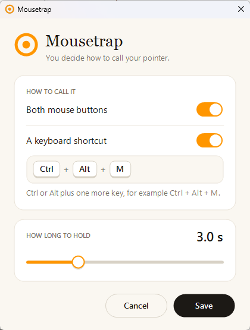
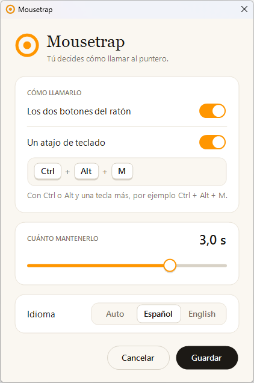

# 🪤 Mousetrap

**Your pointer keeps escaping across screens. This is the trap.**

*El puntero se te escapa entre pantallas. Esta es la ratonera.*


[](https://github.com/bmp95/mousetrap/actions/workflows/build.yml)

[**🇬🇧 English**](#-english) · [**🇪🇸 Español**](#-español)

**[⬇️ Download · Descargar Mousetrap.exe](https://github.com/bmp95/mousetrap/releases/latest/download/Mousetrap.exe)**

---

## 🇬🇧 English

### The problem

Three screens, one pointer and no idea where it went. We all know the ritual: shake the mouse like a maraca and chase whatever moves. It works, but nobody would call it elegant.

**Mousetrap** takes a different approach: don't look for it, make it come to you. Hold both mouse buttons for 3 seconds and the pointer shows up in the middle of the screen you choose, marked with an orange disc that is hard to miss.

### ⚙️ How it works

| Mechanism | What it does |
|---|---|
| ⏱️ **Two buttons, 3 seconds** | Left and right together: a gesture you almost never make by accident. If you do, the hold time can be changed in Settings |
| ⌨️ **Or your own shortcut** | If you prefer the keyboard, record whatever combination you like (Ctrl + Alt + M, say) by pressing it once. It works alongside the mouse gesture or instead of it |
| 🎯 **Jump to the centre** | Of the main screen, the screen the pointer is already on, or a specific one; you pick from the tray |
| 🟠 **Orange disc** | Marks the spot for a moment so your eye finds it first time |
| 🤫 **No ghost clicks** | Letting go of the buttons clicks nothing and opens no context menu on whatever was underneath |
| 🖥️ **Any screen layout** | Different zoom levels, portrait screens, screens sitting higher than the main one: the centre is the centre |
| 🪶 **A single 65 KB exe** | No installer, no admin rights, no network connections |

### ⬇️ Install

1. Download [**Mousetrap.exe**](https://github.com/bmp95/mousetrap/releases/latest/download/Mousetrap.exe) from the [latest release](https://github.com/bmp95/mousetrap/releases/latest). It is a single file; there is no installer.
2. Put it somewhere it can stay, such as `Documents\Mousetrap`, and double-click it.
3. The first time, Windows may say it protected your PC, because the exe isn't signed: choose **More info → Run anyway**.
4. The Mousetrap icon, an orange box propped up on a stick, appears in the system tray, next to the clock. If you don't see it, it is behind the **^** arrow of hidden icons; drag it onto the taskbar to keep it in view.
5. From then on it starts with Windows, and a notification says so the first time. If you would rather start it yourself, right-click the icon and untick **Start with Windows**.

It needs Windows 10 or 11 and nothing else. To remove it, untick **Start with Windows**, choose **Exit** in the same menu and delete the file; your settings are in `%APPDATA%\Mousetrap`.

### 🖱️ Usage

1. Check that Mousetrap is running: its icon is in the system tray, next to the clock.
2. Hold both mouse buttons for 3 seconds.
3. The pointer shows up in the middle of the main screen.

Right-click the tray icon to choose the destination, and not much else:

| Option | What it does |
|---|---|
| The main screen | Always the middle of the main screen (default) |
| The screen the pointer is already on | Centres it without changing screens |
| Screen 1, 2, 3… | Always that screen; if it gets unplugged, falls back to the main one |
| Settings… | Opens the settings window; clicking the icon opens it too |
| Start with Windows | Launches on sign-in. On from the first run; untick it to stop |
| Exit | Closes the trap |

The app speaks Spanish on Spanish systems and English everywhere else, unless you pick a language in Settings.

### 🎛️ Settings

<p align="center"></p>

"Settings…" in the tray menu opens a window with the only things there are to decide:

- **How to call it**: with both mouse buttons, with a keyboard shortcut, or with both.
- **The shortcut**: click the box and press the keys. It takes Ctrl or Alt plus one more key. If another program already uses the combination, or it types a character on your keyboard (Ctrl + Alt + 2 is @ on a Spanish one), the window says so and won't save it.
- **How long to hold**: from 0.5 to 4 seconds.
- **Language**: the one Windows is in (Auto), Spanish or English.

It takes effect on Save, no restart needed. Everything lands in `%APPDATA%\Mousetrap\config.ini`, which you can also edit by hand; if you do, restart the app afterwards.

```ini
# primary | cursor | a display name such as \\.\DISPLAY2
target=primary
# milliseconds the buttons or the shortcut must be held (minimum 500)
hold_ms=3000
# on | off: whether both mouse buttons call the pointer
mouse=on
# a keyboard shortcut that also calls it; empty for none
hotkey=Ctrl+Alt+M
# auto (the language Windows is in), es or en
language=auto
```

### 🎯 Technical decisions

| Decision | Why |
|---|---|
| 🪝 **No mouse or keyboard hooks** | A timer asks 20 times a second whether both buttons are down (`GetAsyncKeyState`). Nothing sits between your mouse and the rest of your programs |
| 🟠 **The disc earns its keep** | It appears right under the pointer and is the one that receives the button releases, so they never reach the window underneath |
| ⌨️ **Windows keeps the shortcut** | It is registered as a system-wide hot key (`RegisterHotKey`): while you hold it, Windows keeps it and it never reaches the program in front. Still no hooks |
| ✋ **The half-finished press is cancelled** | Before jumping, it tells the window that had the press in progress to give up (`WM_CANCELMODE`), as Windows does when a dialog pops up, so the jump isn't taken for a drag |
| 📐 **Per-monitor DPI** | Without it, coordinates get scaled on screens whose zoom differs from the main one and the pointer lands off-centre |
| 🧰 **Built with what Windows ships** | The .NET Framework 4 C# compiler comes with Windows 10 and 11: no SDK, no NuGet, nothing to install |

### 🧪 Tests

| Command | What it checks |
|---|---|
| `test.cmd` | 43 logic tests: hold detection, keyboard shortcuts, configuration and screen choice |
| `test.cmd e2e` | The above plus an end-to-end test against the real `.exe` |

Every change is built and tested on GitHub Actions, and the exe attached to each release is the one built there, not one from anybody's PC.

The end-to-end test presses buttons and keys with synthetic input over a window of its own and checks where the pointer ends up, so it **takes over the mouse and the keyboard for about 30 seconds**. Exit the app first if it is running.

> 😄 Yes: to test an app that moves your mouse, you have to let something move your mouse.

### ▶️ Build

```bat
build.cmd
```

The result lands in `dist\Mousetrap.exe`.

### ⚠️ Limitations

- It does nothing while the active window belongs to a program running as administrator (Task Manager, for example): Windows won't let a normal program see the mouse state there.
- In games that hold both buttons for several seconds, the pointer will jump too. Exit the app from the tray while you play.
- The executable isn't signed, so some antivirus tools scan or hold it the first time it runs.

### 📄 License

© 2026 Bernabé Muñoz Peñas. Free software under the [GNU GPL v3.0](LICENSE): use it, modify it and redistribute it; if you distribute a modified version, it has to ship with its source under this same licence.

### 🔏 Code signing policy

Free code signing provided by [SignPath.io](https://signpath.io), certificate by [SignPath Foundation](https://signpath.org). The application is pending, so the releases published so far are not signed yet.

- Committers and reviewers: [Bernabé Muñoz Peñas](https://github.com/bmp95)
- Approvers: [Bernabé Muñoz Peñas](https://github.com/bmp95)
- Privacy policy: this program will not transfer any information to other networked systems unless specifically requested by the user or the person installing or operating it.

---

## 🇪🇸 Español

### El problema

Tres pantallas, un puntero y ni idea de dónde está. Todos conocemos el ritual: sacudir el ratón como una maraca y perseguir con la mirada lo primero que se mueva. Funciona, pero elegante no es.

**Mousetrap** parte de otra idea: no lo busques, hazlo venir. Mantén pulsados los dos botones del ratón durante 3 segundos y el puntero aparece en el centro de la pantalla que tú elijas, marcado con un disco naranja difícil de no ver.

### ⚙️ Cómo funciona

| Mecanismo | Qué hace |
|---|---|
| ⏱️ **Dos botones, 3 segundos** | Izquierdo y derecho a la vez: un gesto que casi nunca se hace por accidente. Si a ti sí te pasa, el tiempo se cambia en Ajustes |
| ⌨️ **O tu propio atajo** | Si prefieres el teclado, graba la combinación que quieras (Ctrl + Alt + M, por ejemplo) pulsándola una vez. Funciona junto al gesto del ratón o en su lugar |
| 🎯 **Salto al centro** | A la pantalla principal, a la pantalla donde ya esté el puntero o a una concreta; se elige desde la bandeja |
| 🟠 **Disco naranja** | Marca el sitio un instante para que el ojo lo encuentre a la primera |
| 🤫 **Sin clics fantasma** | Al soltar los botones no se pulsa nada ni se abre ningún menú contextual en lo que hubiera debajo |
| 🖥️ **Pantallas de todo tipo** | Con distinto zoom, en vertical o colocadas más arriba que la principal: el centro es el centro |
| 🪶 **Un solo exe de 65 KB** | Sin instalador, sin permisos de administrador y sin conectarse a nada |

### ⬇️ Instalación

1. Descarga [**Mousetrap.exe**](https://github.com/bmp95/mousetrap/releases/latest/download/Mousetrap.exe) de la [última release](https://github.com/bmp95/mousetrap/releases/latest). Es un solo fichero; no hay instalador.
2. Guárdalo en un sitio donde se pueda quedar, por ejemplo `Documentos\Mousetrap`, y haz doble clic en él.
3. La primera vez Windows puede decir que protegió tu PC, porque el exe no está firmado: pulsa **Más información → Ejecutar de todas formas**.
4. El icono de Mousetrap, una caja naranja apoyada en un palo, aparece en la bandeja del sistema, junto al reloj. Si no lo ves, está detrás de la flecha **^** de iconos ocultos; arrástralo a la barra de tareas para tenerlo a la vista.
5. A partir de ahí arranca con Windows, y la primera vez lo avisa con una notificación. Si prefieres abrirlo tú, haz clic derecho en el icono y desmarca **Iniciar con Windows**.

Solo necesita Windows 10 u 11. Para quitarlo, desmarca **Iniciar con Windows**, elige **Salir** en ese mismo menú y borra el fichero; tus ajustes están en `%APPDATA%\Mousetrap`.

### 🖱️ Uso

1. Comprueba que Mousetrap está en marcha: su icono está en la bandeja del sistema, junto al reloj.
2. Mantén pulsados los dos botones del ratón durante 3 segundos.
3. El puntero aparece en el centro de la pantalla principal.

Con el botón derecho sobre el icono se elige el destino y poco más:

| Opción | Qué hace |
|---|---|
| La pantalla principal | Siempre al centro de la principal (por defecto) |
| La pantalla donde ya esté el puntero | Lo centra sin cambiarlo de pantalla |
| Pantalla 1, 2, 3… | Siempre a esa pantalla; si la desenchufas, vuelve a la principal |
| Ajustes… | Abre la ventana de ajustes; también se abre con un clic en el icono |
| Iniciar con Windows | Arranca sola al iniciar sesión. Viene marcado desde la primera vez; desmárcalo para evitarlo |
| Salir | Cierra la ratonera |

### 🎛️ Ajustes

<p align="center"></p>

«Ajustes…» en el menú de la bandeja abre una ventana con lo único que hay que decidir:

- **Cómo llamarlo**: con los dos botones del ratón, con un atajo de teclado o con las dos cosas.
- **El atajo**: haz clic en el recuadro y pulsa las teclas. Lleva Ctrl o Alt y una tecla más. Si la combinación ya la usa otro programa, o en tu teclado escribe un carácter (Ctrl + Alt + 2 es la @ en un teclado español), la ventana lo dice y no la guarda.
- **Cuánto mantenerlo**: de 0,5 a 4 segundos.
- **Idioma**: el de Windows (Auto), español o inglés.

Se aplica al guardar, sin reiniciar. Todo queda en `%APPDATA%\Mousetrap\config.ini`, que también se puede editar a mano; en ese caso, reinicia la aplicación después.

```ini
# primary | cursor | nombre de la pantalla, por ejemplo \\.\DISPLAY2
target=primary
# milisegundos que hay que mantener los botones o el atajo (mínimo 500)
hold_ms=3000
# on | off: si los dos botones del ratón llaman al puntero
mouse=on
# atajo de teclado que también lo llama; vacío para no usar ninguno
hotkey=Ctrl+Alt+M
# auto (el idioma de Windows), es o en
language=auto
```

### 🎯 Decisiones técnicas

| Decisión | Por qué |
|---|---|
| 🪝 **Sin ganchos de ratón ni de teclado** | Un temporizador pregunta 20 veces por segundo si los dos botones están pulsados (`GetAsyncKeyState`). Nada se interpone entre tu ratón y el resto de programas |
| 🟠 **El disco también trabaja** | Aparece justo debajo del puntero y es él quien recibe las sueltas de los botones; por eso no llegan a la ventana que haya debajo |
| ⌨️ **El atajo lo guarda Windows** | Se registra como atajo global del sistema (`RegisterHotKey`): mientras lo mantienes, Windows se lo queda y no llega al programa que tengas delante. Sigue sin haber ganchos |
| ✋ **La pulsación a medias se cancela** | Antes de saltar avisa a la ventana que tenía el clic en curso (`WM_CANCELMODE`), como hace Windows cuando aparece un diálogo; así el salto no se toma por un arrastre |
| 📐 **DPI por monitor** | Sin ello, en pantallas con un zoom distinto al de la principal las coordenadas se escalan y el puntero cae descentrado |
| 🧰 **Compilado con lo que trae Windows** | El compilador de C# de .NET Framework 4 viene de serie en Windows 10 y 11: ni SDK, ni NuGet, ni nada que instalar |

### 🧪 Tests

| Comando | Qué comprueba |
|---|---|
| `test.cmd` | 43 tests de la lógica: detección de la pulsación, atajos de teclado, configuración y elección de pantalla |
| `test.cmd e2e` | Lo anterior y una prueba de extremo a extremo contra el `.exe` real |

Cada cambio se compila y se prueba en GitHub Actions, y el exe de cada release es el que sale de ahí, no el de ningún ordenador particular.

La prueba de extremo a extremo pulsa botones y teclas con entrada sintética sobre una ventana propia y comprueba dónde acaba el puntero, así que **toma el control del ratón y del teclado unos 30 segundos**. Cierra antes la aplicación si la tienes abierta.

> 😄 Sí: para probar una app que mueve el ratón hay que dejar que te muevan el ratón.

### ▶️ Compilar

```bat
build.cmd
```

El resultado queda en `dist\Mousetrap.exe`.

### ⚠️ Limitaciones

- No actúa mientras la ventana activa sea de un programa abierto como administrador (el Administrador de tareas, por ejemplo): Windows no deja que un programa normal vea ahí el estado del ratón.
- En juegos que usan los dos botones a la vez durante varios segundos, el puntero también saltará. Sal de la aplicación desde la bandeja mientras juegas.
- El ejecutable no está firmado, así que algunos antivirus lo analizan o retienen la primera vez que se ejecuta.

### 📄 Licencia

© 2026 Bernabé Muñoz Peñas. Software libre bajo la [GNU GPL v3.0](LICENSE): puedes usarlo, modificarlo y redistribuirlo; si distribuyes una versión modificada, tiene que ir con su código y bajo esta misma licencia.

### 🔏 Política de firma de código

Firma de código gratuita proporcionada por [SignPath.io](https://signpath.io), con certificado de [SignPath Foundation](https://signpath.org). La solicitud está pendiente, así que las versiones publicadas hasta ahora aún no van firmadas.

- Autores y revisores: [Bernabé Muñoz Peñas](https://github.com/bmp95)
- Aprobadores: [Bernabé Muñoz Peñas](https://github.com/bmp95)
- Política de privacidad: este programa no transfiere ninguna información a otros sistemas en red salvo que lo pida expresamente el usuario o quien lo instale o lo opere.

---

<sub>Built by [Bernabé Muñoz Peñas](https://www.linkedin.com/in/bernabemunozpenas/) · C# · WinForms · Win32</sub>
